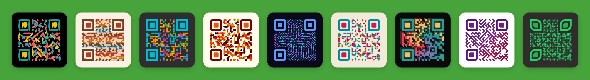

# Design QR codes people want to scan

QRocodile is a QR code platform: a free, browser-based designer with 45+ styles, animated codes, logos and halos, plus an API that renders the exact same designs server-side — no watermark, no lock-in.

Style a code once, reuse it everywhere. [qrocodile.io](https://qrocodile.io/en/) for the designer, [qrocodile.io/en/qr-code-api](https://qrocodile.io/en/qr-code-api/) for the API and a free key.

## API clients

| Language   | Repo                                                             | Install                                        |
| ---------- | ----------------------------------------------------------------- | ------------------------------------------------- |
| Node / TS  | [qrocodile-api-node](https://github.com/qrocodile-io/qrocodile-api-node) | `npm i @qrocodile/api`                     |
| Go         | [qrocodile-api-go](https://github.com/qrocodile-io/qrocodile-api-go)     | `go get github.com/qrocodile-io/qrocodile-api-go` |

## Resources

- [API reference & docs](https://qrocodile.io/en/qr-code-api/)
- [OpenAPI / Swagger UI](https://api.qrocodile.io/docs)
- [QR Designer](https://qrocodile.io/en/)

## License

All clients and integrations are MIT licensed unless noted otherwise in the repo.
